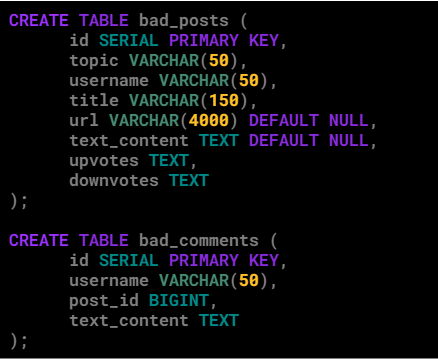

# Udiddit, a social news aggregator

Project for Udacity PostgreSQL course 

## Introduction

Udiddit, a social news aggregation, web content rating, and discussion website, is currently using a risky and unreliable Postgres database schema to store the forum posts, discussions, and votes made by their users about different topics.

The schema allows posts to be created by registered users on certain topics, and can include a URL or a text content. It also allows registered users to cast an upvote (like) or downvote (dislike) for any forum post that has been created. In addition to this, the schema also allows registered users to add comments on posts.

Here is the DDL used to create the schema:

## Starter sql

Its strange part, for me. 
I will add initial sql for cover next steps.

bad_db.sql

Something goes wrong when I tried to add entire sql file
And I divide it into two separate ones:

bad-db-create.sql creates initial schema 

bad-db-insert.sql inserts data for starter project

## Part I: Investigate the existing schema

I will go as it is, column by column.

First, the topic and username from bad_posts should have separate TABLEs. And we only left here topic_id and user_id. And make them a FOREIGN KEYs. It is about one of the normal forms rule an logic staffs)
Because one user can have a lot of posts as well as comments in other TABLE bad_comments. And we will have even less topics on the real network. In imaginary one too)))
About the length of both (and title column) VARCHARs I will think about it a bit later.

url VARCHAR(4000) DEFAULT NULL needs to be a little bit shorter, almost 2 thouthend charters less. Because the maximum length of the url is 2048 characters. And, it is a pessimistic approach. Have you seen a real life url which has a length of 1_000 characters? I’m not. And I am not expecting to see.
You can be familiarised with url length on [this stack overflow post](https://stackoverflow.com/questions/417142/what-is-the-maximum-length-of-a-url-in-different-browsers)

Then it is strange that text_content is DEFAULT NULL. 
That suppose that we can have empty posts, which is not true. And didn't have logic. Or we can post only the url of external sors without any text, can we? It may be NOT NULL as well as a part of rest columns: topic_id, user_id and probably title

About upvotes and downvotes. I’m not sure yet about how to realise them. Maybe it has some specific requirement in later chapters. But for now, at list, we need to have something like a votes table where we will have post_id, voter_id and COLUMN like SMALLINT with 1 or -1. I’m not pretty sure at this point. It depends on how we treat deleted users, and how we will display the quantity of votes and voters. Probably, for network performance reasons we will store separately the total amount of positive and negative votes.

And one more remark. At this point I supposed that after a post is done it can not be edited. But… We know that is wrong. In every network or forum, even in primitive one, users can edit their posts. It has a line of thinking that I will left for later time, when I will have a better understanding of the entire system.
In real world work, when I think something like “O, I will do this simple/quick way and after I would be sure that all other parts work perfectly, I will return here and make it properly”... It simply never happens.

I will return later and will make proper hightliting and editing in general)))

## Part II: Create the DDL for your new schema

Requarement:

### Guideline #1

here is a list of features and specifications that Udiddit needs in order to support its website and administrative interface:
* Allow new users to register:
  * Each username has to be unique
  * Usernames can be composed of at most 25 characters
  * Usernames can’t be empty
  * We won’t worry about user passwords for this project
* Allow registered users to create new topics:
  * Topic names have to be unique.
  * The topic’s name is at most 30 characters
  * The topic’s name can’t be empty
  * Topics can have an optional description of at most 500 characters.
* Allow registered users to create new posts on existing topics:
  * Posts have a required title of at most 100 characters
  * The title of a post can’t be empty.
  * Posts should contain either a URL or a text content, but not both.
  * If a topic gets deleted, all the posts associated with it should be automatically deleted too.
  * If the user who created the post gets deleted, then the post will remain, but it will become dissociated from that user.
* Allow registered users to comment on existing posts:
A comment’s text content can’t be empty.
Contrary to the current linear comments, the new structure should allow comment threads at arbitrary levels.
If a post gets deleted, all comments associated with it should be automatically deleted too.
If the user who created the comment gets deleted, then the comment will remain, but it will become dissociated from that user.
If a comment gets deleted, then all its descendants in the thread structure should be automatically deleted too.
Make sure that a given user can only vote once on a given post:
Hint: you can store the (up/down) value of the vote as the values 1 and -1 respectively.
If the user who cast a vote gets deleted, then all their votes will remain, but will become dissociated from the user.
If a post gets deleted, then all the votes for that post should be automatically deleted too.

### Guideline #2

here is a list of queries that Udiddit needs in order to support its website and administrative interface. Note that you don’t need to produce the DQL for those queries: they are only provided to guide the design of your new database schema.
List all users who haven’t logged in in the last year.
List all users who haven’t created any post.
Find a user by their username.
List all topics that don’t have any posts.
Find a topic by its name.
List the latest 20 posts for a given topic.
List the latest 20 posts made by a given user.
Find all posts that link to a specific URL, for moderation purposes. 
List all the top-level comments (those that don’t have a parent comment) for a given post.
List all the direct children of a parent comment.
List the latest 20 comments made by a given user.
Compute the score of a post, defined as the difference between the number of upvotes and the number of downvotes

### Guidline  #3: 

you’ll need to use normalization, various constraints, as well as indexes in your new database schema. You should use named constraints and indexes to make your schema cleaner.

### Guideline #4: 

your new database schema will be composed of five (5) tables that should have an auto-incrementing id as their primary key.

### New DDL:

## Part III: Migrate the provided data

Now that your new schema is created, it’s time to migrate the data from the provided schema in the project’s SQL Workspace to your own schema. This will allow you to review some DML and DQL concepts, as you’ll be using INSERT...SELECT queries to do so. Here are a few guidelines to help you in this process:

Topic descriptions can all be empty
Since the bad_comments table doesn’t have the threading feature, you can migrate all comments as top-level comments, i.e. without a parent
You can use the Postgres string function regexp_split_to_table to unwind the comma-separated votes values into separate rows
Don’t forget that some users only vote or comment, and haven’t created any posts. You’ll have to create those users too.
The order of your migrations matter! For example, since posts depend on users and topics, you’ll have to migrate the latter first.
Tip: You can start by running only SELECTs to fine-tune your queries, and use a LIMIT to avoid large data sets. Once you know you have the correct query, you can then run your full INSERT...SELECT query.
NOTE: The data in your SQL Workspace contains thousands of posts and comments. The DML queries may take at least 10-15 seconds to run.

The DML to migrate the current data in bad_posts and bad_comments to your new database schema:

## Rubricts

Project specifications to [meet](https://review.udacity.com/#!/rubrics/2802/view)

## Free course about making beautifull READMEs

[Writing READMEs course](https://www.udacity.com/course/writing-readmes--ud777)

It is mot an advertisement)))
